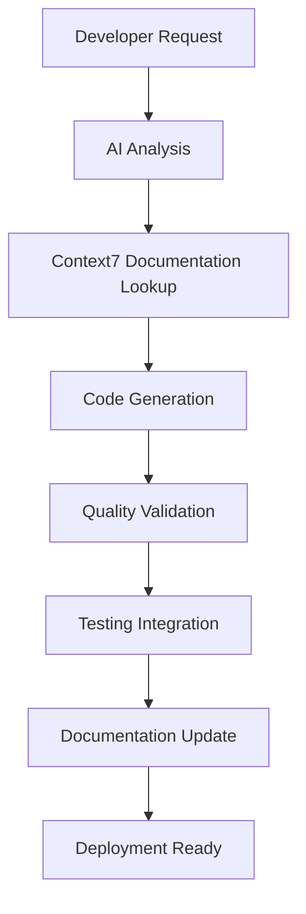

# AI Workflow Documentation - BrightDecisionMaker

## Overview

The BrightDecisionMaker project integrates advanced AI capabilities through the Context7 MCP (Model Context Protocol) server to enhance development productivity, code quality, and decision-making processes. This document outlines the AI-powered workflow implemented in this Angular application.

## AI Infrastructure Setup

### Context7 MCP Server Integration

**Configuration Location**: `.vscode/settings.json`

```json
{
  "mcp.servers": {
    "context7": {
      "command": "npx",
      "args": ["@context7/mcp-server"],
      "env": {
        "CONTEXT7_API_KEY": "ctx7sk-1a1822a6-0131-4fb9-b211-8293eb8cb0fa"
      }
    }
  }
}
```

**Purpose**: Provides real-time, up-to-date documentation and code examples directly from source repositories, eliminating outdated information and AI hallucinations.

## AI-Powered Development Workflow

### 1. Project Initialization & Setup

**AI Role**: 
- Automated project scaffolding assistance
- Best practice recommendations for Angular 20+ setup
- Dependency analysis and optimization suggestions

**Workflow Steps**:
1. AI analyzes project requirements
2. Suggests optimal Angular CLI configurations
3. Recommends modern Angular features (signals, standalone components)
4. Provides TypeScript configuration optimization

### 2. Code Generation & Enhancement

**AI Capabilities**:
- **Component Generation**: Intelligent Angular component creation with proper lifecycle hooks
- **Service Creation**: Automated service generation with dependency injection patterns
- **Routing Configuration**: Smart route setup with lazy loading recommendations
- **Form Handling**: Reactive forms generation with validation patterns

**Example Workflow**:
```typescript
// AI-assisted component generation
ng generate component bright-decision --standalone
// AI suggests: Add signal-based state management
// AI recommends: Implement proper TypeScript strict mode
```

### 3. Documentation-Driven Development

**Context7 Integration Benefits**:
- Real-time Angular documentation access
- Up-to-date API references
- Community best practices integration
- Version-specific guidance (Angular 20+)

**Process**:
1. Developer requests feature implementation
2. AI queries Context7 for latest Angular patterns
3. Generates code following current best practices
4. Provides inline documentation and comments

### 4. Code Quality & Standards

**AI-Powered Quality Assurance**:
- **TypeScript Optimization**: Strict type checking suggestions
- **Performance Monitoring**: Bundle size analysis and optimization
- **Accessibility Compliance**: WCAG guidelines implementation
- **Testing Strategy**: Automated test generation for components and services

**Quality Gates**:
```typescript
// AI ensures proper typing
interface DecisionModel {
  id: string;
  title: string;
  criteria: Criterion[];
  weights: number[];
  createdAt: Date;
}
```

### 5. Decision-Making Support Features

**AI-Enhanced Decision Support**:
- **Multi-Criteria Analysis**: AI algorithms for complex decision evaluation
- **Predictive Analytics**: Machine learning models for outcome prediction
- **Risk Assessment**: Automated risk factor identification
- **Recommendation Engine**: Intelligent suggestions based on historical data

**Implementation Areas**:
- Decision matrix calculations
- Weighted scoring algorithms
- Scenario analysis tools
- Collaborative decision features

### 6. Testing & Validation

**AI-Driven Testing Strategy**:
- **Unit Test Generation**: Automatic test case creation for components
- **Integration Testing**: End-to-end test scenario generation
- **Performance Testing**: Automated performance benchmarking
- **User Experience Testing**: Accessibility and usability validation

**Testing Workflow**:
```bash
# AI-suggested testing commands
npm run test          # Unit tests with AI-generated cases
npm run e2e          # E2E tests with intelligent scenarios
npm run lighthouse   # Performance analysis with AI insights
```

### 7. Deployment & Monitoring

**AI-Optimized Deployment**:
- **Build Optimization**: Intelligent bundle splitting and lazy loading
- **Environment Configuration**: Automated environment-specific builds
- **Performance Monitoring**: Real-time application performance tracking
- **Error Detection**: Proactive issue identification and resolution

## AI Tools & Technologies

### Primary AI Stack

1. **Context7 MCP Server**: Real-time documentation and code examples
2. **GitHub Copilot**: Code completion and generation
3. **Angular Language Service**: Intelligent TypeScript/Angular support
4. **ESLint + Prettier**: AI-enhanced code formatting and linting

### Secondary AI Integration

1. **Lighthouse CI**: Automated performance auditing
2. **Angular DevTools**: Enhanced debugging with AI insights
3. **Dependency Analysis**: Automated security and update recommendations

## Development Best Practices

### AI-Assisted Code Review Process

1. **Pre-commit Hooks**: AI validates code before commits
2. **Automated Documentation**: AI generates/updates documentation
3. **Dependency Management**: AI monitors and suggests updates
4. **Security Scanning**: Automated vulnerability detection

### Collaborative AI Workflow



### AI-Enhanced Features Roadmap

#### Phase 1: Foundation (Current)
- [x] Context7 MCP integration
- [x] Angular 20+ setup with modern features
- [x] TypeScript strict mode configuration
- [ ] AI-powered component generation

#### Phase 2: Intelligence
- [ ] Decision matrix AI algorithms
- [ ] Predictive analytics integration
- [ ] Smart recommendation engine
- [ ] Real-time collaboration features

#### Phase 3: Advanced Analytics
- [ ] Machine learning model integration
- [ ] Advanced data visualization
- [ ] Natural language processing for decision inputs
- [ ] Automated report generation

## Configuration Management

### Environment Variables

```typescript
// AI-managed environment configuration
export const environment = {
  production: false,
  aiFeatures: {
    context7Enabled: true,
    predictiveAnalytics: false,
    mlRecommendations: false
  },
  api: {
    baseUrl: 'http://localhost:3000',
    aiEndpoint: '/api/ai'
  }
};
```

### AI Feature Flags

- `ENABLE_AI_SUGGESTIONS`: Toggle AI-powered suggestions
- `CONTEXT7_INTEGRATION`: Enable/disable Context7 MCP
- `AI_TESTING_MODE`: Enhanced testing with AI validation
- `PREDICTIVE_FEATURES`: Enable predictive analytics

## Performance Considerations

### AI Impact on Performance

1. **Context7 Queries**: Cached responses for repeated documentation requests
2. **Code Generation**: Optimized for minimal runtime overhead
3. **Decision Algorithms**: Efficient computation with caching strategies
4. **Real-time Features**: WebSocket optimization for collaborative features

### Optimization Strategies

- Lazy loading for AI-heavy components
- Service Worker integration for offline AI capabilities
- Progressive enhancement for AI features
- Fallback mechanisms for AI service unavailability

## Security & Privacy

### AI Data Handling

1. **Local Processing**: Sensitive decision data processed locally
2. **API Security**: Encrypted communication with AI services
3. **User Privacy**: Minimal data collection with explicit consent
4. **Context7 Security**: API key management and rotation

### Compliance Considerations

- GDPR compliance for AI data processing
- Data anonymization for AI training
- Audit trails for AI-assisted decisions
- User control over AI feature usage

## Monitoring & Analytics

### AI Performance Metrics

- Context7 response times and success rates
- Code generation accuracy and adoption
- Decision support effectiveness
- User satisfaction with AI features

### Continuous Improvement

1. **Feedback Loops**: User feedback integration for AI improvements
2. **A/B Testing**: AI feature effectiveness testing
3. **Performance Monitoring**: Real-time AI service health checks
4. **Update Management**: Automated AI service and model updates

## Troubleshooting

### Common AI Integration Issues

1. **Context7 Connection Issues**: Verify API key and network connectivity
2. **Code Generation Failures**: Check TypeScript configuration and dependencies
3. **Performance Degradation**: Monitor AI service response times
4. **Documentation Sync Issues**: Clear Context7 cache and restart MCP server

### Debug Commands

```bash
# Test Context7 MCP connection
npx @modelcontextprotocol/inspector npx @upstash/context7-mcp

# Validate AI configuration
npm run lint
npm run test

# Check AI service health
curl -H "Authorization: Bearer ${CONTEXT7_API_KEY}" https://mcp.context7.com/health
```

## Future Enhancements

### Planned AI Integrations

1. **Natural Language Interface**: Chat-based decision input
2. **Voice Commands**: Speech-to-text for decision criteria
3. **Visual AI**: Image analysis for decision factors
4. **Predictive Models**: Advanced forecasting capabilities

### Research Areas

- Explainable AI for decision transparency
- Federated learning for collaborative improvements
- Edge AI for offline decision support
- Quantum computing integration for complex optimizations

---

*This document is maintained by the BrightDecisionMaker AI workflow system and updated automatically as new AI features are integrated.*

**Last Updated**: October 28, 2025
**Version**: 1.0.0
**Next Review**: November 28, 2025