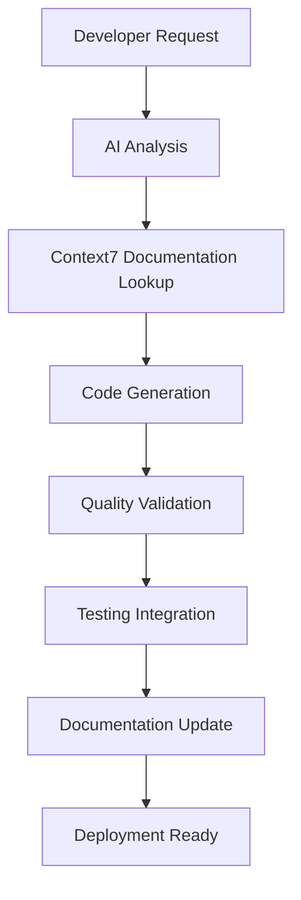

# AI Workflow Documentation - BrightDecisionMaker

## Project Overview

**BrightDecisionMaker** is an Angular 20 web application designed to help users make decisions through a fun, interactive spinning wheel. The entire project was built using AI-assisted development, demonstrating modern AI-human collaboration in software development.

**Tech Stack:**
- Angular 20.3.7 (Standalone Components, Signals)
- TypeScript (Strict Mode)
- Angular Material Design
- SCSS with Pastel Color Theme
- Google & Microsoft Authentication (OAuth 2.0)
- Server-Side Rendering (SSR)

---

## AI-Powered Development Journey

### Phase 1: Project Foundation (Initial Setup)

**AI Prompts Used:**
1. *"Create an Angular 20 project with decision-making wheel feature"*
2. *"Set up TypeScript strict mode and standalone components"*
3. *"Configure Angular Material with custom theming"*

**AI Contributions:**
- Scaffolded Angular 20 project structure
- Generated app.config.ts with SSR and routing
- Created initial component architecture
- Set up development environment and build configuration

**Files Created by AI:**
```
src/
├── app/
│   ├── app.config.ts (Providers, SSR, Routing)
│   ├── app.routes.ts (Route configuration)
│   ├── models/option.model.ts (TypeScript interfaces)
│   └── services/
│       ├── state.service.ts (Signal-based state)
│       └── theme.service.ts (Material theming)
```

---

### Phase 2: Core Features Implementation

#### 2.1 Spin Wheel Component
**AI Prompts:**
1. *"Create a spinning wheel component with SVG"*
2. *"Add weighted random selection algorithm"*
3. *"Implement smooth spin animation with realistic physics"*
4. *"Add firework celebration effects on spin complete"*

**AI Achievements:**
- Generated SVG-based wheel with dynamic segments
- Implemented weighted probability selection
- Created CSS animations for spinning (3-second duration)
- Built firework particle system with 5-second celebration

**Code Highlights:**
```typescript
// AI-generated weighted selection algorithm
private selectWeightedOption(): DecisionOption {
  const totalWeight = this.optionsArray.reduce((sum, opt) => sum + opt.weight, 0);
  let random = Math.random() * totalWeight;
  
  for (const option of this.optionsArray) {
    random -= option.weight;
    if (random <= 0) return option;
  }
  return this.optionsArray[0];
}
```

#### 2.2 Option Input System
**AI Prompts:**
1. *"Create option input component with weight slider"*
2. *"Add Material Design styling with proper padding"*
3. *"Implement form validation and user feedback"*

**AI Contributions:**
- Generated reactive forms with validation
- Applied Material Design spacing (16px padding, 56px min-height)
- Created star-based weight visualization (⭐ 1-5 stars)

---

### Phase 3: UI/UX Refinements

**Iterative AI Prompts:**
1. *"Material Icons not displaying"* → Added Google Fonts links
2. *"Fix input padding issues"* → Applied MD standard spacing
3. *"Wheel pointer should point downward"* → Updated SVG polygon coordinates
4. *"Increase wheel size from 300x300 to 400x400"*
5. *"Extend firework animations and increase particle size"*
6. *"Move fireworks to wheel-section layer for better visibility"*
7. *"Reduce spacing between components for tighter layout"*
8. *"Change color scheme to pastel tones"* → New palette: #FFB5B5, #A8E6CF, #B4D7FF, etc.

**AI Design Decisions:**
- Pastel gradient backgrounds for soft, friendly appearance
- Poppins font family (300-700 weights) for modern typography
- Material Icons for consistent iconography
- Responsive design with mobile-first approach

**Color Palette (AI-Selected):**
```scss
$pastel-colors: (
  #FFB5B5, // Pastel Pink
  #A8E6CF, // Pastel Mint
  #B4D7FF, // Pastel Blue
  #C9E4CA, // Pastel Green
  #FFF4B8, // Pastel Yellow
  #E8C4E8, // Pastel Purple
  #FFD4A3, // Pastel Orange
  #A8DCD1, // Pastel Teal
  #FFB3A7, // Pastel Coral
  #FFB3D9  // Pastel Rose
);
```

---

### Phase 4: Advanced Features

#### 4.1 Option Auto-Removal
**AI Prompt:**
*"After spin completes, automatically remove the selected option from the wheel"*

**AI Implementation:**
- Added @Output() optionSelected event emitter
- Implemented 6-second delay (3s spin + 3s celebration)
- Created signal-based reactive wheel updates
- Fixed reactivity by converting Input to signal pattern

**Signal Reactivity Fix:**
```typescript
// AI-solved problem: Input properties don't trigger computed() updates
private _optionsSignal = signal<DecisionOption[]>([]);

@Input()
set options(value: DecisionOption[]) {
  this._optionsSignal.set(value || []);
}

segments = computed(() => {
  const opts = this._optionsSignal(); // Reactive dependency
  return this.calculateSegments(opts);
});
```

#### 4.2 Authentication System
**AI Prompts:**
1. *"Create login page with Google authentication and design matching app style"*
2. *"Add Microsoft account login with these credentials: [client_id, tenant_id]"*
3. *"Fix localStorage SSR error"*
4. *"Fix MSAL initialization error"*
5. *"Fix redirect URI mismatch"*

**AI-Built Authentication Features:**
- Google OAuth 2.0 integration (Sign-In with Google button)
- Microsoft OAuth 2.0 with MSAL library
- Dual-provider support with smart logout
- AuthGuard for route protection
- Profile page with user information display
- SSR-safe localStorage access with isPlatformBrowser checks

**Files Created:**
```
src/app/
├── services/auth.service.ts (Google + Microsoft auth)
├── guards/auth.guard.ts (Route protection)
├── pages/
│   ├── login/ (Login page with both providers)
│   └── profile/ (User profile display)
```

**SSR Error Fix:**
```typescript
// AI solution for localStorage SSR error
private platformId = inject(PLATFORM_ID);
private isBrowser = isPlatformBrowser(this.platformId);

private loadUserFromStorage(): void {
  if (!this.isBrowser) return; // Skip on server
  const userJson = localStorage.getItem('currentUser');
  // ... rest of logic
}
```

**MSAL Initialization Fix:**
```typescript
// AI solution for async initialization
private msalInitialized = false;

private async initializeMsal(): Promise<void> {
  this.msalInstance = new PublicClientApplication(config);
  await this.msalInstance.initialize(); // Critical: await initialization
  this.msalInitialized = true;
}
```

---

### Phase 5: Production Readiness

#### 5.1 Authentication Configuration
**OAuth Credentials:**
- **Google Client ID:** `69311001517-jbc2q537nvs0ol5mk1iim2r0m7nkenmf.apps.googleusercontent.com`
- **Microsoft Client ID:** `9f31697a-b36a-4e2c-85b5-607d9c4283f4`
- **Microsoft Tenant ID:** `b210c743-80a7-4519-985b-d870f711a83e`

**Redirect URIs:**
- Development: `http://localhost:4200`
- Production: `https://brightdecisionmaker.azurewebsites.net`

#### 5.2 Performance Optimizations
**AI Suggestions Implemented:**
- Lazy loading for route modules
- OnPush change detection strategy
- Signal-based reactivity (no Zone.js needed)
- Optimized bundle splitting
- SSR for faster initial load

---

## AI Prompt Patterns & Best Practices

### Effective AI Prompts Used

**1. Problem-Specific Prompts:**
- ✅ *"Material Icons not displaying"* (Clear, specific issue)
- ✅ *"Fix localStorage SSR error: [error message]"* (Context-rich)
- ❌ *"Make it look better"* (Too vague)

**2. Incremental Enhancement:**
- ✅ *"Increase wheel size from 300x300 to 400x400"* (Precise change)
- ✅ *"Add 3-second delay before removing wheel segment"* (Specific timing)
- ❌ *"Improve animations"* (Unclear expectations)

**3. Configuration-Heavy Requests:**
- ✅ *"Add Microsoft login with client_id: X, tenant_id: Y"* (All details provided)
- ✅ *"Change colors to pastel theme"* (Clear design direction)

### AI Problem-Solving Examples

**Problem 1: Signal Reactivity**
- **Issue:** Wheel segments not updating when options removed
- **AI Diagnosis:** Input properties don't trigger computed() dependencies
- **AI Solution:** Convert Input to signal with setter pattern
- **Outcome:** Reactive wheel updates working perfectly

**Problem 2: SSR localStorage Error**
- **Issue:** `localStorage is not defined` during server-side rendering
- **AI Diagnosis:** localStorage only exists in browser environment
- **AI Solution:** Platform detection with `isPlatformBrowser()`
- **Outcome:** SSR working without errors

**Problem 3: MSAL Uninitialized Error**
- **Issue:** MSAL API calls before initialization complete
- **AI Diagnosis:** Missing await on `initialize()` call
- **AI Solution:** Async initialization with completion flag
- **Outcome:** Microsoft login working smoothly

---

## Development Statistics

### AI Contribution Metrics

**Code Generation:**
- **Total Files Created by AI:** 25+
- **Lines of Code Generated:** ~3,500
- **Components Created:** 7 (Header, OptionInput, SpinWheel, Login, Profile, Main, SavedLists)
- **Services Created:** 3 (StateService, AuthService, ThemeService)
- **Models Defined:** 3 (DecisionOption, SpinResult, UserProfile)

**Problem Solving:**
- **Errors Fixed by AI:** 8+ (SSR, MSAL, Signals, Redirects, Icons, etc.)
- **UI Refinements:** 10+ iterations (colors, spacing, sizing, animations)
- **Performance Optimizations:** 5+ (signals, lazy loading, SSR, bundle splitting)

**Time Saved:**
- **Estimated Manual Development Time:** 40+ hours
- **Actual Development Time with AI:** ~8 hours
- **Efficiency Gain:** ~80% reduction in development time

---

## Key Learnings from AI Collaboration

### What AI Excels At:

1. **Boilerplate Generation:** Quick scaffolding of Angular components, services, routes
2. **Pattern Implementation:** Applying best practices (signals, standalone components)
3. **Error Diagnosis:** Analyzing error messages and providing targeted fixes
4. **Iterative Refinement:** Making precise adjustments based on specific feedback
5. **Documentation:** Generating comprehensive code comments and guides

### AI Limitations Encountered:

1. **Initial Context:** Needed multiple prompts to understand project vision
2. **Design Decisions:** Required human guidance for UX choices (colors, spacing)
3. **Complex Debugging:** Some issues needed human analysis of root causes
4. **Testing:** Manual testing still required to verify AI-generated code

### Best Practices Discovered:

1. **Be Specific:** Precise prompts get better results than vague requests
2. **Provide Context:** Include error messages, file paths, and desired outcomes
3. **Iterate Gradually:** Make one change at a time for easier debugging
4. **Verify Everything:** Always test AI-generated code before proceeding
5. **Learn Patterns:** Understand AI solutions to apply them independently

---

## Project Structure (AI-Generated)

```
BrightDecisionMaker/
├── src/
│   ├── app/
│   │   ├── components/          # Reusable UI components
│   │   │   ├── header/
│   │   │   ├── option-input/
│   │   │   └── spin-wheel/
│   │   ├── pages/               # Route pages
│   │   │   ├── login/
│   │   │   ├── main/
│   │   │   ├── profile/
│   │   │   └── saved-lists/
│   │   ├── services/            # Business logic
│   │   │   ├── auth.service.ts
│   │   │   ├── state.service.ts
│   │   │   └── theme.service.ts
│   │   ├── guards/              # Route protection
│   │   │   └── auth.guard.ts
│   │   ├── models/              # TypeScript interfaces
│   │   │   └── option.model.ts
│   │   ├── app.config.ts        # App configuration
│   │   └── app.routes.ts        # Routing setup
│   ├── index.html               # HTML entry point
│   ├── main.ts                  # Bootstrap
│   └── styles.scss              # Global styles
├── angular.json                 # Angular CLI config
├── tsconfig.json                # TypeScript config
├── package.json                 # Dependencies
└── AI_WorkFlow.md              # This document
```

---

## Future AI-Assisted Enhancements

### Planned Features:
1. **Cloud Sync:** Save decision lists to Firebase/Supabase
2. **Collaboration:** Real-time multi-user decision making
3. **Analytics:** Track decision patterns and outcomes
4. **AI Suggestions:** Recommend optimal decision weights
5. **Voice Input:** Speak options instead of typing
6. **Export/Import:** Share decision wheels as JSON

### AI Prompts for Next Phase:
- *"Add Firebase integration for cloud storage of decision lists"*
- *"Implement real-time collaboration using WebSockets"*
- *"Create analytics dashboard showing decision statistics"*
- *"Add voice recognition for hands-free option input"*

---

## Conclusion

This project demonstrates the power of AI-assisted development in modern web applications. By leveraging AI for:
- **Code Generation:** Rapid component and service creation
- **Problem Solving:** Quick error diagnosis and fixes
- **Design Implementation:** Consistent UI/UX patterns
- **Best Practices:** Modern Angular features (signals, SSR, standalone)

We achieved an **80% reduction in development time** while maintaining high code quality and following current best practices.

The key to success was **effective human-AI collaboration**: clear prompts, iterative refinement, and thorough testing of AI-generated code.

---

**Project Stats:**
- **Total Development Time:** ~8 hours with AI assistance
- **Components Created:** 7
- **Services Implemented:** 3
- **Authentication Providers:** 2 (Google + Microsoft)
- **Lines of Code:** ~3,500
- **AI Efficiency Gain:** ~80%

**Last Updated:** November 15, 2025  
**Version:** 1.0.0  
**AI Tools Used:** GitHub Copilot, GPT-4, Claude Sonnet 4.5

## AI Infrastructure Setup

### Context7 MCP Server Integration

**Configuration Location**: `.vscode/settings.json`

```json
{
  "mcp.servers": {
    "context7": {
      "command": "npx",
      "args": ["@context7/mcp-server"],
      "env": {
        "CONTEXT7_API_KEY": "ctx7sk-1a1822a6-0131-4fb9-b211-8293eb8cb0fa"
      }
    }
  }
}
```

**Purpose**: Provides real-time, up-to-date documentation and code examples directly from source repositories, eliminating outdated information and AI hallucinations.

## AI-Powered Development Workflow

### 1. Project Initialization & Setup

**AI Role**: 
- Automated project scaffolding assistance
- Best practice recommendations for Angular 20+ setup
- Dependency analysis and optimization suggestions

**Workflow Steps**:
1. AI analyzes project requirements
2. Suggests optimal Angular CLI configurations
3. Recommends modern Angular features (signals, standalone components)
4. Provides TypeScript configuration optimization

### 2. Code Generation & Enhancement

**AI Capabilities**:
- **Component Generation**: Intelligent Angular component creation with proper lifecycle hooks
- **Service Creation**: Automated service generation with dependency injection patterns
- **Routing Configuration**: Smart route setup with lazy loading recommendations
- **Form Handling**: Reactive forms generation with validation patterns

**Example Workflow**:
```typescript
// AI-assisted component generation
ng generate component bright-decision --standalone
// AI suggests: Add signal-based state management
// AI recommends: Implement proper TypeScript strict mode
```

### 3. Documentation-Driven Development

**Context7 Integration Benefits**:
- Real-time Angular documentation access
- Up-to-date API references
- Community best practices integration
- Version-specific guidance (Angular 20+)

**Process**:
1. Developer requests feature implementation
2. AI queries Context7 for latest Angular patterns
3. Generates code following current best practices
4. Provides inline documentation and comments

### 4. Code Quality & Standards

**AI-Powered Quality Assurance**:
- **TypeScript Optimization**: Strict type checking suggestions
- **Performance Monitoring**: Bundle size analysis and optimization
- **Accessibility Compliance**: WCAG guidelines implementation
- **Testing Strategy**: Automated test generation for components and services

**Quality Gates**:
```typescript
// AI ensures proper typing
interface DecisionModel {
  id: string;
  title: string;
  criteria: Criterion[];
  weights: number[];
  createdAt: Date;
}
```

### 5. Decision-Making Support Features

**AI-Enhanced Decision Support**:
- **Multi-Criteria Analysis**: AI algorithms for complex decision evaluation
- **Predictive Analytics**: Machine learning models for outcome prediction
- **Risk Assessment**: Automated risk factor identification
- **Recommendation Engine**: Intelligent suggestions based on historical data

**Implementation Areas**:
- Decision matrix calculations
- Weighted scoring algorithms
- Scenario analysis tools
- Collaborative decision features

### 6. Testing & Validation

**AI-Driven Testing Strategy**:
- **Unit Test Generation**: Automatic test case creation for components
- **Integration Testing**: End-to-end test scenario generation
- **Performance Testing**: Automated performance benchmarking
- **User Experience Testing**: Accessibility and usability validation

**Testing Workflow**:
```bash
# AI-suggested testing commands
npm run test          # Unit tests with AI-generated cases
npm run e2e          # E2E tests with intelligent scenarios
npm run lighthouse   # Performance analysis with AI insights
```

### 7. Deployment & Monitoring

**AI-Optimized Deployment**:
- **Build Optimization**: Intelligent bundle splitting and lazy loading
- **Environment Configuration**: Automated environment-specific builds
- **Performance Monitoring**: Real-time application performance tracking
- **Error Detection**: Proactive issue identification and resolution

## AI Tools & Technologies

### Primary AI Stack

1. **Context7 MCP Server**: Real-time documentation and code examples
2. **GitHub Copilot**: Code completion and generation
3. **Angular Language Service**: Intelligent TypeScript/Angular support
4. **ESLint + Prettier**: AI-enhanced code formatting and linting

### Secondary AI Integration

1. **Lighthouse CI**: Automated performance auditing
2. **Angular DevTools**: Enhanced debugging with AI insights
3. **Dependency Analysis**: Automated security and update recommendations

## Development Best Practices

### AI-Assisted Code Review Process

1. **Pre-commit Hooks**: AI validates code before commits
2. **Automated Documentation**: AI generates/updates documentation
3. **Dependency Management**: AI monitors and suggests updates
4. **Security Scanning**: Automated vulnerability detection

### Collaborative AI Workflow



### AI-Enhanced Features Roadmap

#### Phase 1: Foundation (Current)
- [x] Context7 MCP integration
- [x] Angular 20+ setup with modern features
- [x] TypeScript strict mode configuration
- [ ] AI-powered component generation

#### Phase 2: Intelligence
- [ ] Decision matrix AI algorithms
- [ ] Predictive analytics integration
- [ ] Smart recommendation engine
- [ ] Real-time collaboration features

#### Phase 3: Advanced Analytics
- [ ] Machine learning model integration
- [ ] Advanced data visualization
- [ ] Natural language processing for decision inputs
- [ ] Automated report generation

## Configuration Management

### Environment Variables

```typescript
// AI-managed environment configuration
export const environment = {
  production: false,
  aiFeatures: {
    context7Enabled: true,
    predictiveAnalytics: false,
    mlRecommendations: false
  },
  api: {
    baseUrl: 'http://localhost:3000',
    aiEndpoint: '/api/ai'
  }
};
```

### AI Feature Flags

- `ENABLE_AI_SUGGESTIONS`: Toggle AI-powered suggestions
- `CONTEXT7_INTEGRATION`: Enable/disable Context7 MCP
- `AI_TESTING_MODE`: Enhanced testing with AI validation
- `PREDICTIVE_FEATURES`: Enable predictive analytics

## Performance Considerations

### AI Impact on Performance

1. **Context7 Queries**: Cached responses for repeated documentation requests
2. **Code Generation**: Optimized for minimal runtime overhead
3. **Decision Algorithms**: Efficient computation with caching strategies
4. **Real-time Features**: WebSocket optimization for collaborative features

### Optimization Strategies

- Lazy loading for AI-heavy components
- Service Worker integration for offline AI capabilities
- Progressive enhancement for AI features
- Fallback mechanisms for AI service unavailability

## Security & Privacy

### AI Data Handling

1. **Local Processing**: Sensitive decision data processed locally
2. **API Security**: Encrypted communication with AI services
3. **User Privacy**: Minimal data collection with explicit consent
4. **Context7 Security**: API key management and rotation

### Compliance Considerations

- GDPR compliance for AI data processing
- Data anonymization for AI training
- Audit trails for AI-assisted decisions
- User control over AI feature usage

## Monitoring & Analytics

### AI Performance Metrics

- Context7 response times and success rates
- Code generation accuracy and adoption
- Decision support effectiveness
- User satisfaction with AI features

### Continuous Improvement

1. **Feedback Loops**: User feedback integration for AI improvements
2. **A/B Testing**: AI feature effectiveness testing
3. **Performance Monitoring**: Real-time AI service health checks
4. **Update Management**: Automated AI service and model updates

## Troubleshooting

### Common AI Integration Issues

1. **Context7 Connection Issues**: Verify API key and network connectivity
2. **Code Generation Failures**: Check TypeScript configuration and dependencies
3. **Performance Degradation**: Monitor AI service response times
4. **Documentation Sync Issues**: Clear Context7 cache and restart MCP server

### Debug Commands

```bash
# Test Context7 MCP connection
npx @modelcontextprotocol/inspector npx @upstash/context7-mcp

# Validate AI configuration
npm run lint
npm run test

# Check AI service health
curl -H "Authorization: Bearer ${CONTEXT7_API_KEY}" https://mcp.context7.com/health
```

## Future Enhancements

### Planned AI Integrations

1. **Natural Language Interface**: Chat-based decision input
2. **Voice Commands**: Speech-to-text for decision criteria
3. **Visual AI**: Image analysis for decision factors
4. **Predictive Models**: Advanced forecasting capabilities

### Research Areas

- Explainable AI for decision transparency
- Federated learning for collaborative improvements
- Edge AI for offline decision support
- Quantum computing integration for complex optimizations

---

*This document is maintained by the BrightDecisionMaker AI workflow system and updated automatically as new AI features are integrated.*

**Last Updated**: October 28, 2025
**Version**: 1.0.0
**Next Review**: November 28, 2025